<h2><code>&gt; Hi, I'm Abhishek Pandey</code></h2>

B.Tech Data Science @ Gulzar Group of Institutions &nbsp;·&nbsp; Building HEALTH. &nbsp;·&nbsp; Organizing @GDG &amp; @TEDx

  

<h3><code>abhi@github ~ $ ./contributions.sh</code></h3>

  

<h3><code>abhi@github ~ $ whoami</code></h3>
<table>
  <tr>
    <td valign="top"></td>
    <td valign="top"></td>
  </tr>
</table>

 

Portrait, card, and heatmap are self-contained animated SVGs — no third-party stats widgets, no tracking, refreshed daily by a GitHub Action.

